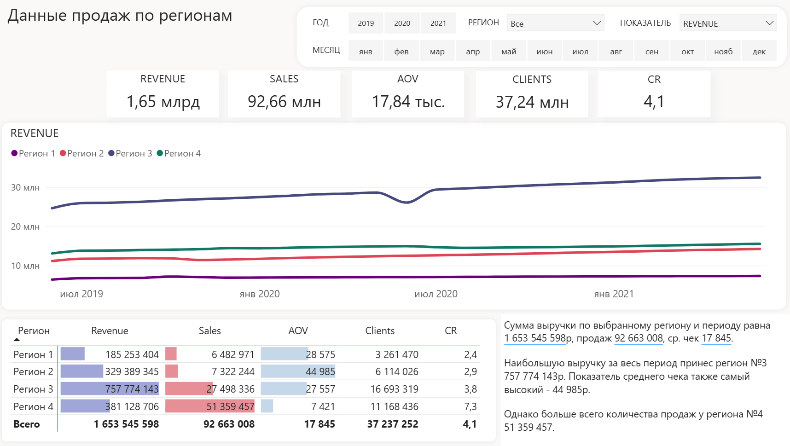
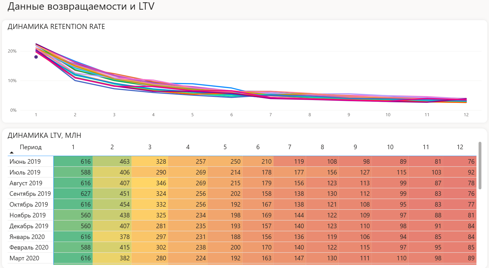
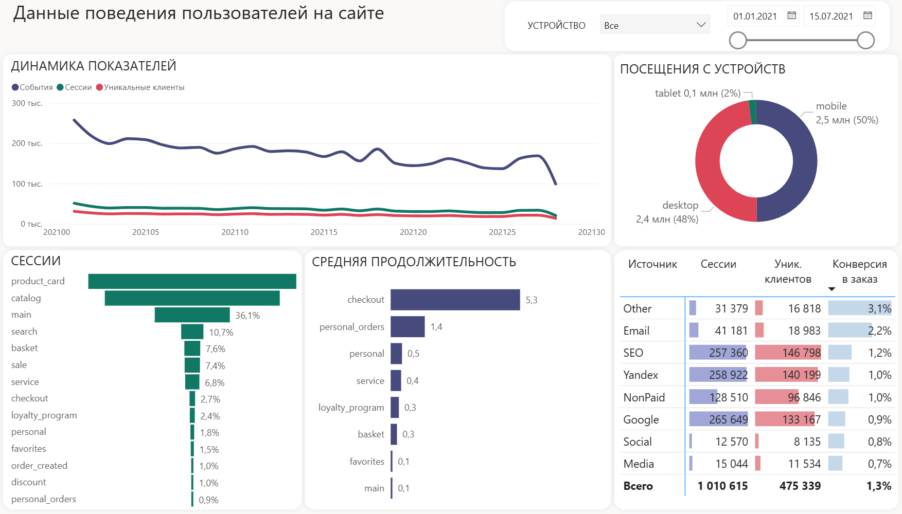
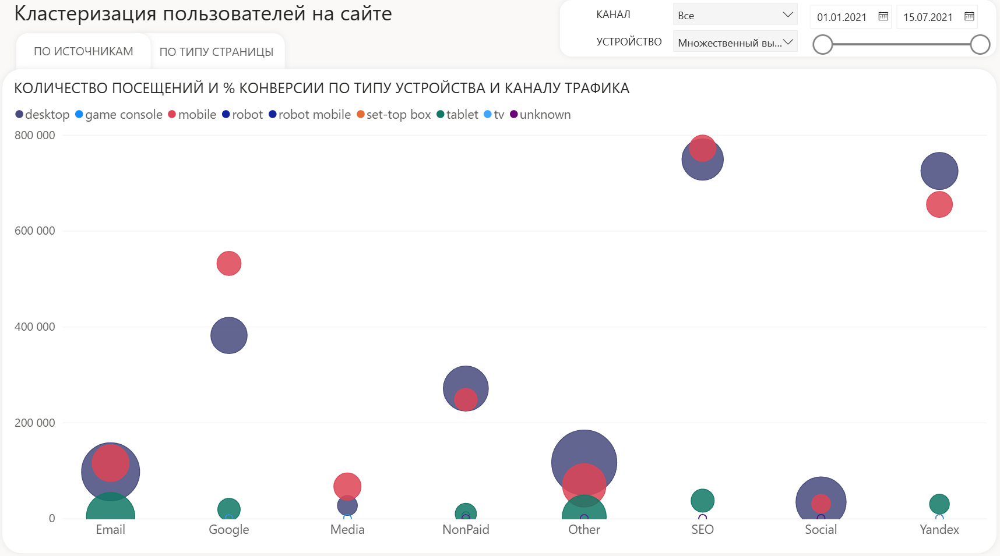
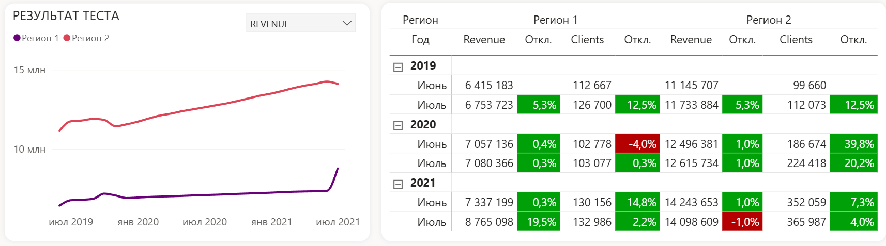

# Определение возможных изменений и точек роста в продукте на основе данных

## О проекте
Дипломный проект, выполненный в рамках программы "Продуктовая аналитика". Защищён с оценкой "отлично" в июле 2023г.

Цель работы - оценить последствия повышения цен для бизнеса, спрогнозировать LTV новых когорт и найти точки роста конверсии на сайте через анализ
поведения пользователей.

## Стек и инструменты
- **Python:** pandas, sqlalchemy
- **SQL:** MySQL
- **BI:** Power BI

## Методология
- **Сравнительный анализ регионов** по выручке, заказам и клиентам для выбора тестовой группы.
- **Когортный анализ** и расчёт retention rate по месяцам жизни клиента.
- **Прогноз LTV** на 12 месяцев для новых когорт.
- **Воронка конверсии** по этапам сайта (main → search → service → checkout).
- **Сегментация** пользователей по устройствам и источникам трафика.

## Скриншоты

### Сравнение регионов

### Retention rate и LTV по когортам

### Поведение пользователей на сайте

### Конверсия и время на страницах в разрезе устройств и источников

## Ключевые выводы

### Главное
1. **Повышение цен прошло успешно** - выручка в регионе №1 выросла на 19,5% без оттока клиентов - можно масштабировать на остальные регионы.
2. **LTV новых когорт выше среднего на 24%**, но retention rate снизился на 4пп после повышения цен - требуется контроль удержания.
3. **Мобильная версия сайта - главная точка роста конверсии**: по всем источникам мобильные и планшеты показывают конверсию в 2–7 раз ниже, чем ПК.
4. **Главные потери в воронке** - после этапа main: до search доходит только 11% пользователей.

Показать детальные выводы по заданиям

#### Задание 1. Повышение цен
- Регион №1 выбран основным для теста; регион №2 - сопоставим по выручке и заказам.
- После повышения цен в июле: регион №1 - выручка +19,5%, клиенты +2%, заказы +9%;
  регион №2 - выручка −1%, клиенты −4%, заказы −5% (некритично).
- Оттока покупателей не зафиксировано - тест успешен, можно масштабировать.

#### Задание 2. Прогноз LTV
- Максимальная возвращаемость - в 1–2 месяцы после первой покупки, средний retention rate ~21%.
- После повышения цен retention снизился на 4пп.
- Прогноз LTV июльской когорты 2021: 6 217 719 руб против средней выручки других когорт 4 995 804 руб (+24%).

#### Задание 3. Анализ сайта
- Максимальное время на странице - checkout: 4,3 мин (ПК), 6,8 мин (планшет), 6,3 мин (мобильный).
- Крупнейшая потеря - 56% оттока после этапа service.
- До search доходит только 11% от первого этапа - проблема после main.
- Лучшая конверсия - other и email, основной трафик - Google и Яндекс.
- Три гипотезы:
  1. Необходимо устранить проблему при осуществлении поиска. Возможно, иконка или строка незаметны и теряются на сайте, отчего пользователю трудно её      обнаружить. В таком случае поможет A/B-тестирование с изменением цветов, размеров, местоположения знака поиска.
     Также стоит улучшить распознавание введеных слов с опечатками, транслитом, чтобы в любом случае поиск смог распознать название товара. Это            улучшит конверсию переходов на следующие этапы, т.к. посетители, использующие внутренний поиск по сайту, как правило, совершают гораздо более         высокую конверсию, чем те, кто этого не делает, по причине того, что такие клиенты уже знают нужный им продукт и имеют высокое намерение его          купить.
  2. Упростить checkout на мобильных (автозаполнение, меньше шагов).
  3. Перераспределить бюджет в email/SEO/Яндекс.

#### Задание 4. Поведение по устройствам
- Конверсия мобильных ниже ПК по всем источникам:
  - Google checkout: 0,7% (мобильный) vs 1,5% (ПК)
  - Social personal: 0,4% (мобильный) vs 2,9% (ПК)
  - SEO checkout: 0,6% (планшет) vs 2% (ПК)
- Подтверждена гипотеза о приоритете улучшения мобильной версии.
- В дополнение к имеющимся данным по поведению посетителей можно было бы добавить информацию о географии и демографии пользователей, по "тепловой карте кликов" на сайте, о времени загрузки страниц, а также по выручке и расходам различных источников трафика, чтобы оптимизировать бюджет по ним.

## Практическая значимость
- **Ценообразование:** обоснован сценарий повышения цен с контролем retention.
- **Маркетинг:** рекомендовано перераспределить бюджет в каналы с высокой конверсией.
- **Продукт:** три приоритетные гипотезы для A/B-тестов на сайте (поиск, checkout, мобильная версия).
