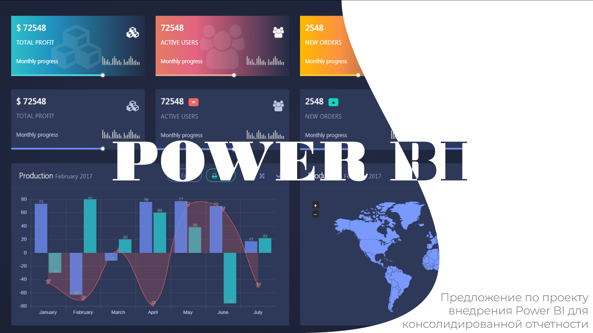
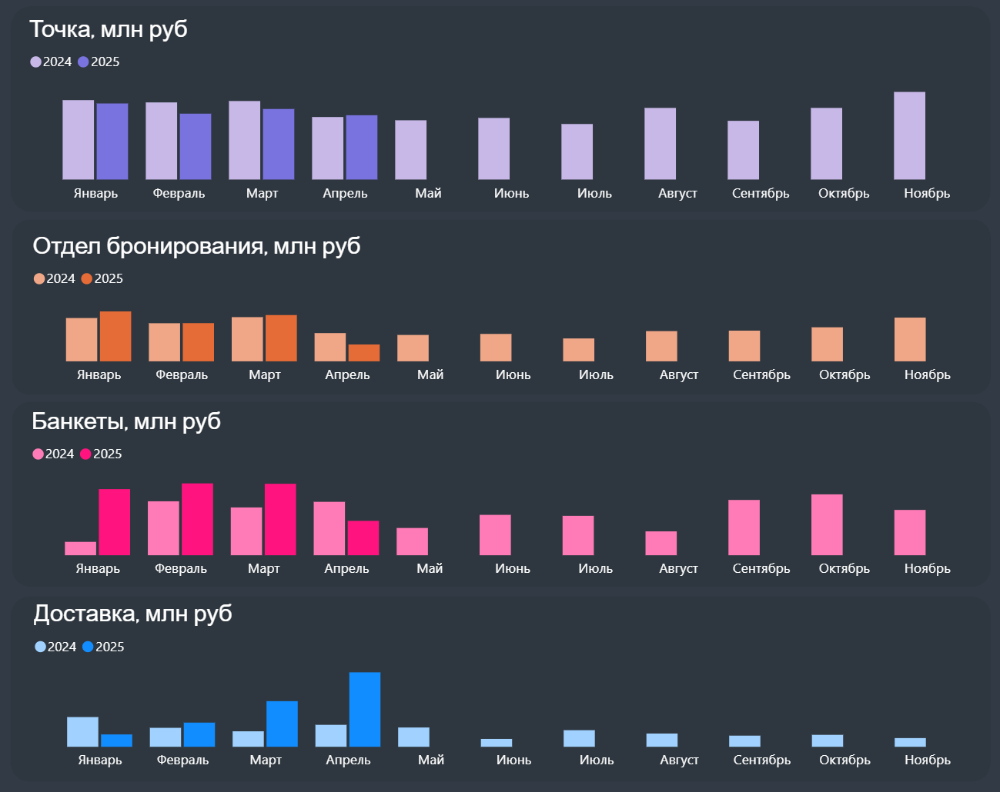
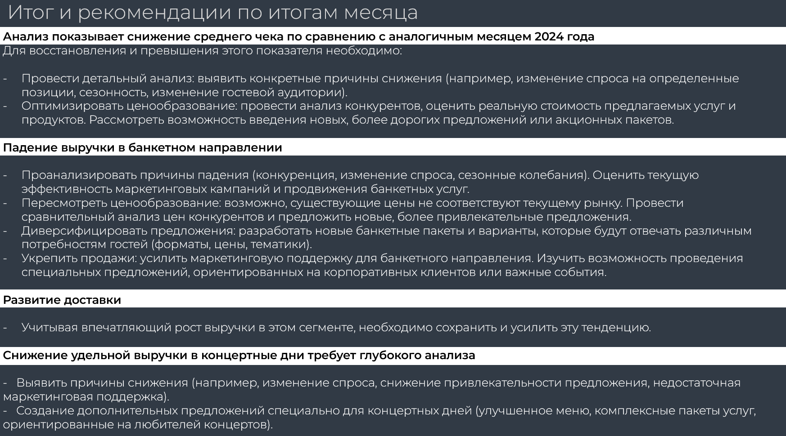

# Внедрение Power BI для консолидированной отчётности

## О проекте
Инициировала и запустила внедрение Power BI в компании для консолидации 
данных по каналам продаж из нескольких источников. Ранее данные собирались 
вручную из разных систем - руководители видели итоги только к 15-му числу 
следующего месяца. После внедрения данные стали доступны в режиме реального времени, 
что позволяет принимать решения в течение месяца, а не постфактум.

## Роль
Инициатор и исполнитель проекта: обоснование для руководства → 
согласование бюджета → консолидация источников → разработка дашборда → 
регулярная ежемесячная отчётность для топ-менеджмента.

## Бизнес-задача
Данные по каналам продаж хранились в разных системах и собирались вручную. 
Руководство получало сводную отчётность с задержкой до 15 дней после 
закрытия месяца. Это тормозило принятие оперативных решений.

## Что было сделано

### 1. Обоснование проекта
- Проанализировала текущий процесс сбора данных по каналам.
- Выявила потери от задержки отчётности.
- Подготовила презентацию для генерального директора: проблема, 
  предложение, расчёт стоимости, ожидаемый эффект, план внедрения.
- Согласовала бюджет и сроки.

### 2. Консолидация данных
- Объединила данные из трёх источников в единую модель:
  - **AmoCRM** - бронирования и заявки (отдел бронирования)
  - **Google Sheets** - продажи банкетного отдела
  - **iiko** - операционные данные ресторанов и доставки
- Настроила подключение источников к Power BI.
- Привела данные к единой модели, метрики рассчитываются один раз 
  для всех отчётов.
- Настроила автоматическое обновление данных.

### 3. Дашборд
- Разработала дашборд с ключевыми метриками по каналам продаж.
- Разрезы: каналы, периоды, регионы, будние/выходные/концертные дни и пр.
- Дашборд обновляется автоматически, доступен руководителям 
  в любое время.

### 4. Регулярная отчётность
- Ежемесячно презентовала итоги для топ-менеджмента.
- Формат: ключевые метрики месяца, динамика по каналам, 
  итоги и рекомендации.

## Результаты
- **Скорость получения данных:** с 15 дней после закрытия месяца - 
  до реального времени.
- **Оперативность решений:** руководство может корректировать 
  действия в течение месяца, а не после его закрытия.
- **Единый источник правды:** данные по всем каналам в одном дашборде.
- **Автоматизация:** ручной сбор данных заменён на автообновление.

## Инструменты
- **BI:** Power BI
- **Источники данных:** AmoCRM, Google Sheets, iiko, BigQuery
- **SQL** - для интеграции источников
  
## Ограничения
- Суммы обезличены по условиям NDA.
- Проект реализован в конкретной компании, детали процессов и цифры не публикуются.

## Презентация проекта для генерального директора с обоснованием и расчётом стоимости

[→ Открыть всю презентацию (PDF)](presentations/01-presentetion.pdf)

  
## Ключевые скриншоты реализованного дашборда

### Общий вид дашборда

### Разрез по каналам продаж

### Итоги и рекомендации

