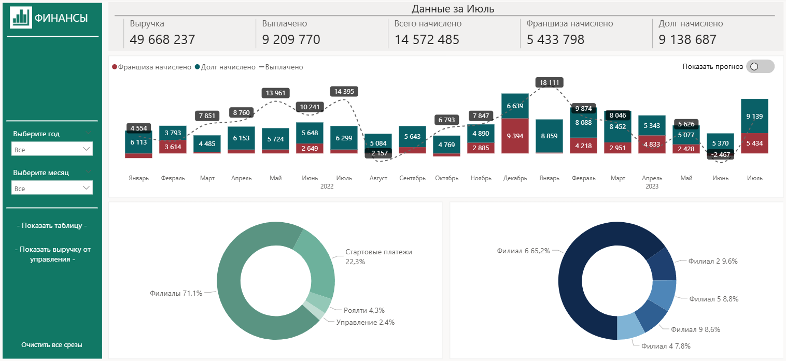

# Data Analytics Dashboards

Портфолио проектов по анализу данных

## О портфолио
Это подборка кейсов, показывающих мой подход к анализу данных. 
Специально выбраны проекты разных типов - BI, исследование, статистика - 
чтобы продемонстрировать широту навыков.

## Демонстрационные кейсы

### 1. Дашборд финансовых и прогнозных показателей сети
Мониторинг инвестиций и сценарный прогноз финансирования.
**Стек:** Power BI, SSMS
[→ Открыть кейс](1-investments/README.md)

### 2. Дашборд дипломной работы на курсе "Продуктовой аналитики"
Оценка последствия повышения цен для бизнеса, прогноз LTV новых когорт и поиск точек роста конверсии на сайте через анализ поведения пользователей.
**Стек:** Python, Power BI, MySQL
[→ Открыть кейс](2-diplom-project/README.md)

