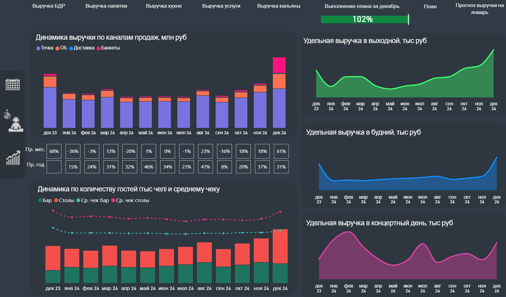
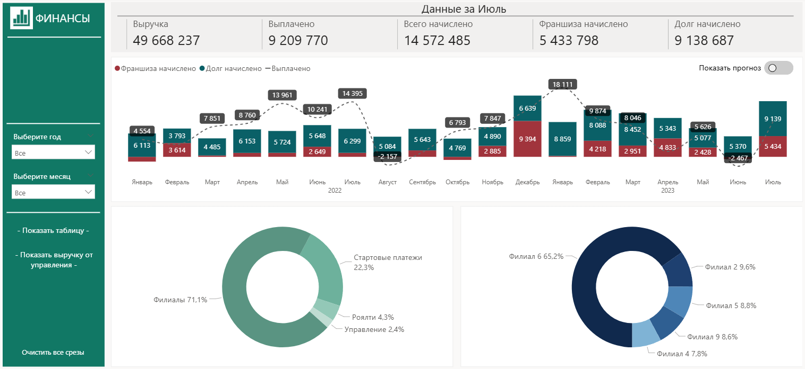
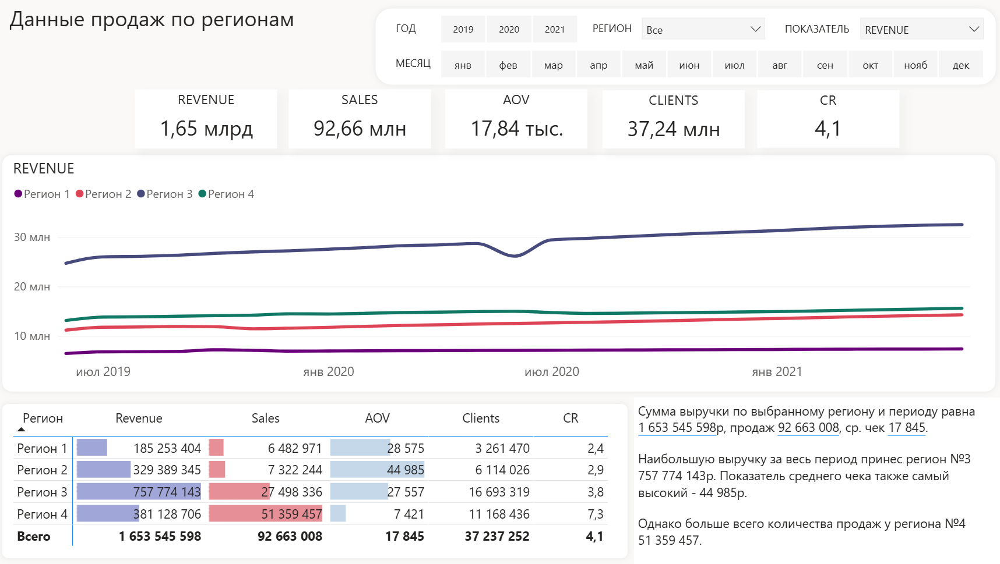

# Data Analytics Dashboards

Примеры работ по анализу данных - от визуализации и исследований до статистических тестов.

## Кейсы

### 1. Внедрение Power BI для консолидированной отчётности
Инициировала и запустила внедрение Power BI в компании для консолидации 
данных по каналам продаж из нескольких источников. Ранее руководители 
видели итоги только к 15-му числу следующего месяца из-за ручной сборки данных - после внедрения 
показатели стали обновляться автоматически и доступны в реальном времени.

**Стек:** Power BI, Power Query, AmoCRM, iiko, Google Sheets

[→ Открыть кейс](3-bi-implementation/README.md)

### 2. Дашборд финансовых и прогнозных показателей сети
Мониторинг инвестиций и сценарный прогноз финансирования.

**Стек:** Power BI, SQL Server

[→ Открыть кейс](1-investments/README.md)

### 3. Дашборд дипломной работы на курсе "Продуктовой аналитики"
Оценка последствий повышения цен для бизнеса, прогноз LTV новых когорт и поиск точек роста конверсии на сайте через анализ поведения пользователей.

**Стек:** Python, Power BI, MySQL

[→ Открыть кейс](2-diplom-project/README.md)

